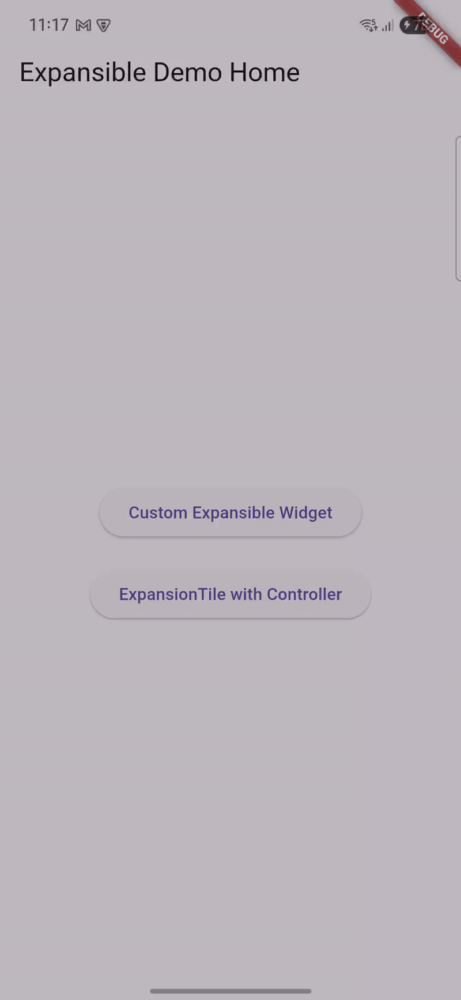

# 🚀 Flutter Expansible Widget Demo

A complete working demo showcasing the new `Expansible` widget introduced in **Flutter 3.32** and how to use the unified `ExpansibleController` to manage expandable UI components — replacing the deprecated `ExpansionTileController`.


## ✨ Features

- Custom expandable components using `Expansible`
- Material-style expansion with `ExpansionTile`
- Unified control with `ExpansibleController`
- Smooth animations using `SizeTransition` and `FadeTransition`
- Clean and readable architecture

## 📦 Requirements

- Flutter SDK 3.32.0 or later

## 📁 Project Structure

```bash
lib/
├── main.dart                        # Entry point of the app
├── pages/
│   ├── custom_expansible_page.dart # Demo using raw Expansible
│   └── expansion_tile_page.dart    # Demo using ExpansionTile + ExpansibleController
└── widgets/
    └── custom_expansion_widget.dart # Reusable custom expandable widget
```
## 📸 Demo



## 🚀 Getting Started

Clone the repo and run the app:

```bash
git clone https://github.com/himanshuagarwal77225/flutter-expansible-demo.git
cd flutter-expansible-demo
flutter pub get
flutter run
```

## 🧪 How to Use

### 1. Using `Expansible` for Custom Widgets

```dart
final controller = ExpansibleController();

Expansible(
  controller: controller,
  headerBuilder: (_, animation) => GestureDetector(
    onTap: controller.toggle,
    child: Text("Tap to Expand"),
  ),
  bodyBuilder: (_, animation) => FadeTransition(
    opacity: animation,
    child: Text("Hidden Content"),
  ),
  expansibleBuilder: (_, header, body, __) => Column(
    children: [header, body],
  ),
);
```

### 2. Using `ExpansibleController` with `ExpansionTile`

```dart
final controller = ExpansibleController();

ExpansionTile(
  controller: controller,
  title: Text("Standard ExpansionTile"),
  children: [Text("Expandable content here")],
);
```

## 📚 Related Flutter Documentation

- 🔗 [Flutter Expansible API Docs](https://api.flutter.dev/)
- 🔗 [Flutter 3.32 Release Notes](https://flutter.dev/docs/development/tools/sdk/release-notes)

## 🧠 When to Use What?

| Widget         | When to Use                                               |
| -------------- | ---------------------------------------------------------|
| `ExpansionTile`| For quick Material-style lists with minimal customization |
| `Expansible`   | For custom UI and animation needs beyond standard widgets |

## 📝 Read the Full Article

Check out the detailed write-up on Medium:
[Expansible in Flutter 3.32 — Why it matters & How to use it](https://himanshu-agarwal.medium.com/expansible-in-flutter-3-32-why-it-matters-how-to-use-it-727eeacb8dd2)


## 🙌 Credits

Made with ❤️ using Flutter 3.32

Cover Illustration generated via [unDraw](https://undraw.co/)


## 📄 License

This project is licensed under the MIT License. See the [LICENSE](LICENSE) file for details.
